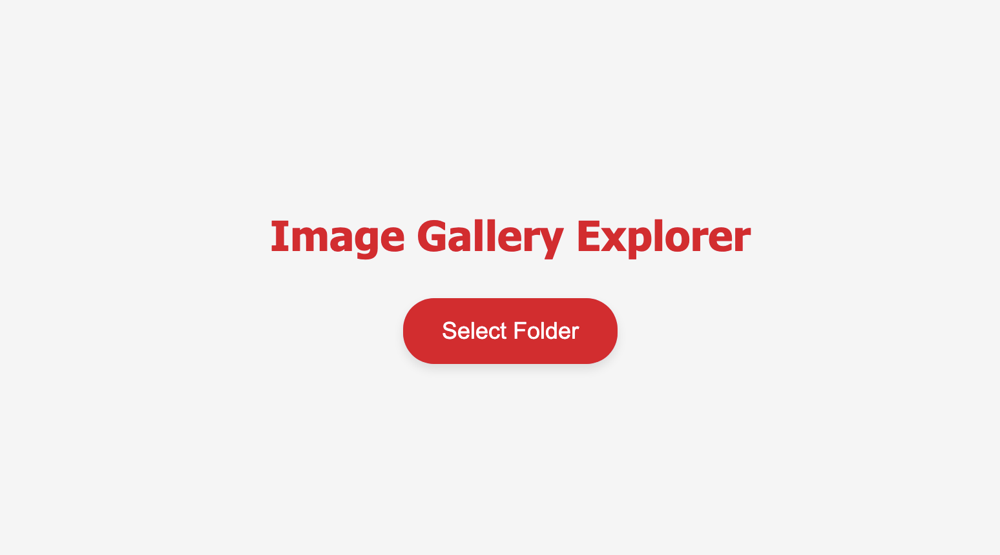
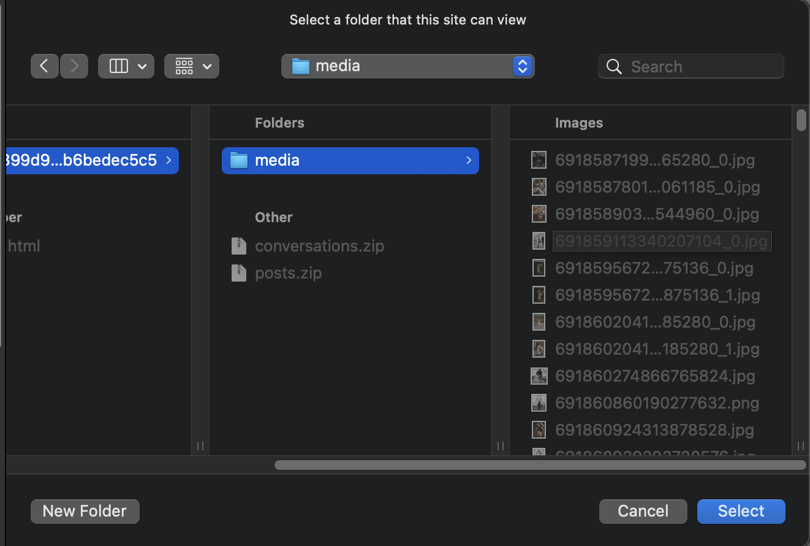
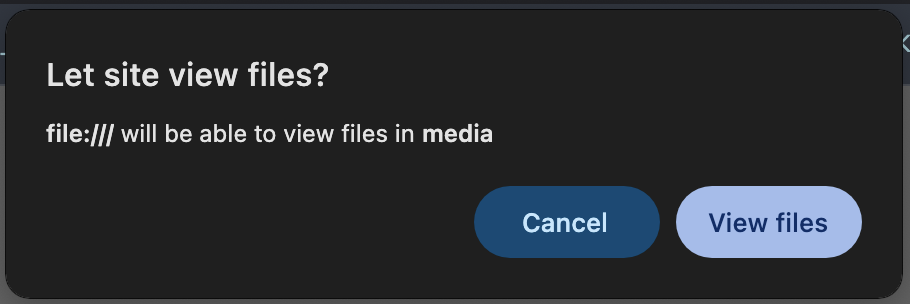

# GalleryExplorer
Local Image Gallery Builder – A web app that automatically creates a visual gallery from your folder's images.

## Dependecies

The application requires browser with "File System Access API":

| Browser | Support |
|--|--|
| Chrome | x |
| Edge | x |
| Firefox | - |
| Opera | x |
| Safari | - |
| Chrome Android | x |
| Firefox for Android | - |
| Opera Android | x |
| Safari on iOS | - |
| Samsung Internet | - |
| WebView Android | x |
| WebView on iOS | - |
| Deno | - |

For more information refer to [Browser compatibility list](https://developer.mozilla.org/en-US/docs/Web/API/Window/showOpenFilePicker#browser_compatibility)

# Usage

1. **Download** the `gallery.html` file to your computer.

2. **Open** it in a browser that supports the **File System Access API** (e.g., Chrome, Edge).

- Tip: In Chrome, go to `File → Open File` and select `gallery.html`.

3. You should now see a webpage similar to the example below.

4. **Click** the "Select Folder" button.

5. **Choose** a folder from your computer (the file picker looks different depending on your OS).

- This folder will be the source of your image gallery.

6. **Confirm** the browser’s permission prompt to access the folder.

7. **Done!** The gallery will load automatically.

- Scroll to browse images or click on any picture to view it in full size.

Enjoy your personalized image gallery! 🎨

# Additional information

## Responsive Layout

The web app features an adaptive layout that adjusts the number of columns based on your screen resolution.

- Minimum columns: 1
- Maximum columns: 7

Tested on:

- Device: 27" iMac
- Resolution: 5120 × 2880 px (218 PPI)
- Browser: Chrome

Lower resolutions will automatically reduce the number of columns displayed.

## Full-Screen View

Clicking any image in the gallery opens it in a full-size overlay above the gallery.

- The background gallery images dim to focus attention on the selected image.
- To exit, click the "×" button (top-right corner) or anywhere outside the image.

## License

This project is licensed under the [MIT license](https://opensource.org/license/mit).
